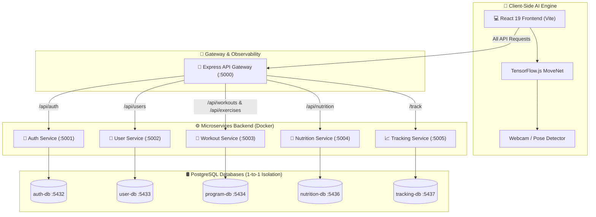

# 🏋️ FitZone — AI-Powered Personal Fitness & Nutrition Microservices Platform

<p align="center">
  
  
  
  
  
  
  
  
</p>

FitZone, web kameranız üzerinden **gerçek zamanlı bilgisayarlı görü (Computer Vision) ve Yapay Zeka** yardımıyla egzersiz hareketlerinizi algılayan, tekrar sayılarınızı ve duruş açılarınızı otomatik sayan; arka planda **API Gateway ve Ölçeklenebilir Mikroservis Mimarisi (Microservices Architecture)** ile çalışan kapsamlı bir kişisel spor ve beslenme takip platformudur.

---

## 🌟 Öne Çıkan Özellikler

### 🤖 1. Gerçek Zamanlı Yapay Zeka Egzersiz Takibi (AI Pose Estimation)
- **MoveNet & TensorFlow.js:** Web kamerası üzerinden 17 ana eklem noktasını (keypoints) WebGL hızlandırması ile tespit eder.
- **Otomatik Rep & Süre Hesabı:**
  - 🏋️ **Tekrar Bazlı Egzersizler:** Biceps Curl, Squat, Push-up, Lunge, Deadlift, Burpee, Jumping Jack (Canlı faz ve tekrar takibi).
  - ⏱️ **Süre Bazlı Egzersizler:** Plank (Vücut duruş açısına göre saniye bazlı aktif süre takibi).
- **Canlı İskelet Çizimi:** Eklemler arası canlı akua/yeşil iskelet çizgileri ve geometrik açı analizi (`geometry.js`).

### 🚪 2. Merkezi API Gateway & Ölçeklenebilir Backend
Platform, tüm istekleri yönlendiren bir **API Gateway (`:5000`)** ve arka planda çalışan **5 bağımsız Node.js & Express mikroservisinden** oluşur:
1. **🚪 API Gateway (`:5000`):** Tüm istemci isteklerinin yönlendirildiği, CORS, Morgan HTTP Loglama ve Resilient Proxy Error Handler içeren merkezi giriş noktası.
2. **🔐 Auth Service (`:5001`):** JWT token tabanlı kimlik doğrulama, şifreleme ve oturum yönetimi.
3. **👤 User Service (`:5002`):** Kullanıcı profilleri, fiziksel ölçümler (kilo, boy) ve kişisel hedef takibi.
4. **💪 Workout Service (`:5003`):** Egzersiz kütüphanesi, antrenman programı oluşturma ve set/tekrar tanımları.
5. **🥗 Nutrition Service (`:3004` / Internal `:5004`):** Öğün takibi, kalori ve makro besin (protein, karbonhidrat, yağ) yönetimi.
6. **📈 Tracking Service (`:3005` / Internal `:5005`):** Antrenman ve beslenme geçmişinin analitiği ve gelişim istatistikleri.

### 🛢️ 3. Tam İzole Veritabanları ve Docker Orchestration
- **5 İzolasyonlu PostgreSQL Konteyneri (Database-per-Service):** Her mikroservis sadece kendi bağımsız PostgreSQL veritabanına bağlanır (`auth-db`, `user-db`, `program-db`, `nutrition-db`, `tracking-db`).
- **Docker & Docker Compose:** Tüm veritabanı konteynerleri, mikroservisler ve API Gateway tek bir `docker-compose up` komutuyla orkestre edilir.
- **Prisma ORM:** Tip güvenli veritabanı sorguları, schema migration yönetimi ve seed verileri.

### 📊 4. İzlenebilirlik (Observability) & Sağlık Kontrolü
- **`/health`:** API Gateway durum kontrolü.
- **`/health/services`:** Tüm alt mikroservislerin anlık çalışırlığını kontrol edip sistem sağlık raporunu sunduğu merkezi izleme endpoint'i.

### 🧪 5. Otomatik Test Altyapısı (Unit & Integration Testing)
- **Backend Testleri:** Jest & Supertest ile API Gateway ve Auth servis testleri.
- **Frontend Testleri:** Vitest & jsdom ile React ve Axios interceptor testleri.

### 🎨 6. Modern & Akıcı Kullanıcı Arayüzü (Frontend UI/UX)
- **React 19 & Vite 6:** Yüksek performanslı SPA mimarisi.
- **Material UI (MUI v7) & TailwindCSS v4:** Modern, responsive ve koyu tema odaklı tasarım.
- **Framer Motion & GSAP:** Akıcı animasyonlar ve sayfa geçişleri.
- **Three.js & Vanta.js:** 3D interaktif arka plan efektleri.
- **Chart.js:** Antrenman ve beslenme ilerleme grafiklerinin görselleştirilmesi.

---

## 🏗️ Sistem Mimarisi (Architecture Overview)



---

## 💻 Kullanılan Teknolojiler

### Frontend
- **React 19**, **Vite 6**, **JavaScript (ES6+)**
- **TensorFlow.js** (`@tensorflow/tfjs`, `@tensorflow-models/pose-detection`)
- **Material UI (MUI v7)**, **TailwindCSS v4**
- **Framer Motion**, **GSAP**, **Three.js**, **Vanta.js**, **Chart.js**
- **Axios**, **React Router v7**
- **Vitest**, **jsdom**

### Backend & DevOps
- **Node.js**, **Express.js**, **http-proxy-middleware**, **Morgan**
- **Prisma ORM**
- **PostgreSQL** (5 Ayrık İzole Veritabanı Konteyneri)
- **Docker** & **Docker Compose**
- **JWT (JSON Web Token)** & **Bcrypt**
- **Jest**, **Supertest**

---

## 🚀 Kurulum ve Çalıştırma (Getting Started)

### Gereksinimler
- **Node.js** (v18+)
- **Docker** & **Docker Compose**
- **Git**

### 1. Repoyu Klonlayın
```bash
git clone https://github.com/LeosiaEN/FitZone.git
cd FitZone
```

### 2. Mikroservisleri, API Gateway'i ve Veritabanlarını Başlatın (Docker)
```bash
# Tüm PostgreSQL veritabanlarını, backend servislerini ve API Gateway'i konteyner olarak başlatın
docker-compose up -d --build
```

### 3. Frontend Uygulamasını Çalıştırın
```bash
cd fitzone-frontend
npm install
npm run dev
```
Uygulama varsayılan olarak `http://localhost:5173` adresinde çalışacaktır.

### 4. Testleri Çalıştırın
- **API Gateway Testleri:** `cd fitzone-backend/api-gateway && npm test`
- **Auth Service Testleri:** `cd fitzone-backend/auth-service && npm test`
- **Frontend Testleri:** `cd fitzone-frontend && npm test`

---

## 📄 Lisans
Bu proje **[PolyForm Noncommercial License 1.0.0](LICENSE)** ile lisanslanmıştır. 

> **🛡️ Kullanım Şartı:** Bu proje kişisel, eğitim ve ticari olmayan (non-commercial) amaçlarla serbestçe incelenebilir ve kullanılabilir. Ticari amaçlı kullanımı veya satışı yasaktır.

<p align="center">
  <sub>Developed with ❤️ by <a href="https://github.com/LeosiaEN">Eren Özdemir (LeosiaEN)</a></sub>
</p>
